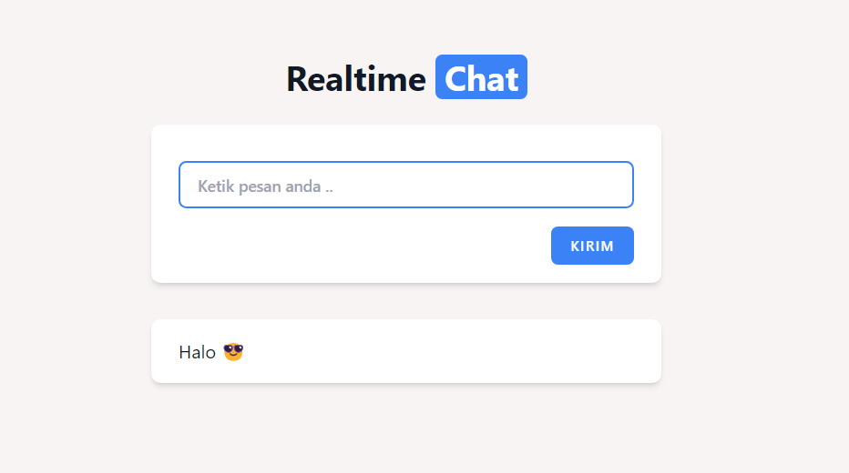

## Laravel Reverb - Realtime Chat 

### Instalasi
1. Clone repository: `git clone https://github.com/ali819/laravel-reverb.git`
2. Masuk ke direktori proyek `cd laravel-reverb`
3. Install dependensi: `composer install`
4. Salin file `.env.example` dan ubah nama menjadi `.env` dengan perintah `cp .env.example .env`
5. Generate key `php artisan key:generate`
6. Jalankan migrasi untuk membuat tabel: `php artisan migrate`
7. Install dependency `npm install` & `npm run build`
8. Jalankan reverb socket `php artisan reverb:start`
9. Jalankan aplikasi: `php artisan serve`
